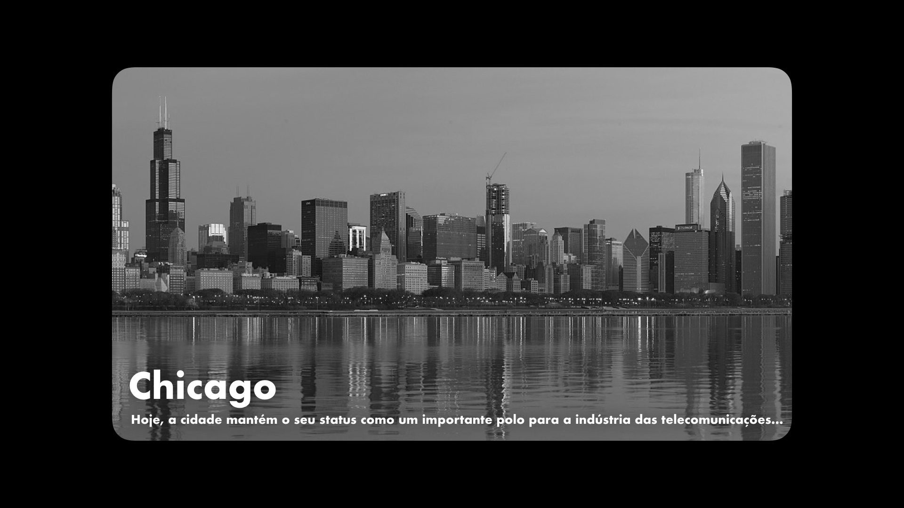
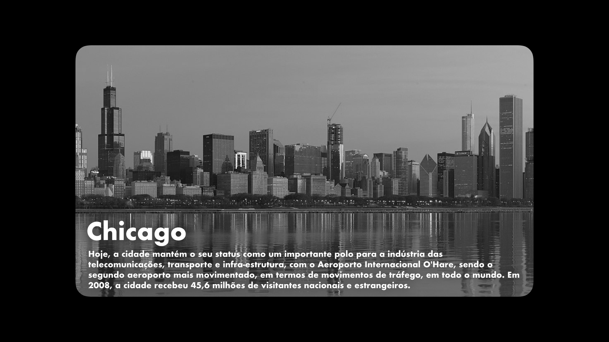

Com cerca de 360 propriedades, não faltam muitas coisas para você conseguir
estilizar basicamente qualquer coisa usando a versão atual do CSS. O maior
problema na verdade está como solucionar problemas de estilização de uma forma
escalável. Escalável para que seu código seja flexível o suficiente para não
ter que ser completamente reescrito no próximo redesign que com certeza vai
acontecer, e também escalável para que seu time possa continuar mantendo
o código por muitos anos.

Em meio a tantos frameworks diferentes e técnicas como Flexbox, Grid CSS,
floats, e até CSS-in-JS, é difícil olhar através do superficial e achar as boas
práticas e hábitos essenciais para escrever CSS que dura.

Após muitos anos como desenvolvedor front-end acabei desvendando alguns
hábitos que me levam a escrever CSS mais escalável. Agora, quase sempre que
encontro estilos difíceis de lidar ou que dão bastante trabalho para refatorar,
percebo que eles não seguem um dos três princípios básicos que vou te ensinar.

Aprender a escrever CSS escalável é essencial, já que independente da sua
abordagem para criar interfaces de usuário na web, você vai precisar
estilizá-la. E, por mais bonita e bem planejada que seja, esta mesma interface
de usuário vai passar por muitas mudanças conforme o produto é alterado. Novas
funcionalidades precisam de espaço. O posicionamento de alguns elementos são
trocados para melhorar a experiência do usuário. Novas páginas são criadas.
Estilos mais "modernos" são propostos. Três hábitos podem nos ajudar a passar
por tudo isso com menos dor de cabeça.

## Abrir mão do posicionamento

Com CSS nós podemos posicionar qualquer elemento em qualquer lugar. Apesar
disso, não é sempre que devemos usar `position: fixed` ou `position: absolute`
para controlar exatamente em qual pixel na tela um elemento estará. Abrir mão
do posicionamento de um elemento vai ainda mais longe do que isso.

Cada vez que tentamos controlar o posicionamento de um elemento, este elemento
se torna menos reutilizável em diferentes contextos e talvez precise ser
refatorado quando o layout das páginas em que são utilizados forem alterados.

Vamos imaginar que temos um componente `Botao`. Por componente, eu quero dizer
um conjunto de HTML, CSS e JS que trabalham juntos – usando ou não um
framework. Este componente geralmente é utilizado em conjunto com outros botões
na nossa interface de usuário. Para posicionar estes componentes poderíamos
recorrer a seletores CSS como `.botao + .botao`, adicionando um pouco de
`margin` entre cada botão. Dessa forma, qualquer lugar que usasse `Botao` teria
o espaçamento entre eles padronizado.

O problema dessa solução é que ela não é escalável. No momento que quisermos
trocar um `Botao` por um `Link`, este espaçamento não seria mais aplicado.
Conforme estas excessões se tornam a regra, poderíamos acabar com diversos
seletores muito específicos: `.botao + .link`, `.link + .botao` e
`.link + .link`. É inviável tentar lidar com espaçamento automático entre
componentes porque não temos certeza de como eles serão utilizados em conjunto
no futuro.

Uma forma melhor de espaçar componentes e evitar este problema com seletores
específicos é dar ao componente que os engloba a responsabilidade de
espaçá-los. Um componente de `Fomulario`, por exemplo, poderia ditar os estilos
de espaçamento entre cada `Botao`, `Link` e `Input`. Controlando o espaçamento
de cima pra baixo na hierarquia dos componentes torna o CSS muito mais
escalável por permitir que componentes de baixo nível possam ser utilizado em
contextos completamente diferentes ao mesmo tempo sem que eles tenham que ter
estilos específicos para cada um desses contextos.

## Abrir mão do tamanho

Assim como abrir mão do posicionamento, abrir mão do tamanho também é um ótimo
hábito para escrever CSS escalável. Em uma página de galeria, por exemplo, nós
poderíamos estilizar o componente `Figura` de tal forma que seu `width` estaria
fixo em `300px`, já que este é o tamanho exato deste elemento no design. Porém,
se decidirmos utilizar `Figura` dentro de um elemento maior ou menor, nós
teríamos problemas.

Ao abrir mão do espaçamento, delegamos ao máximo a definição real do tamanho de
um elemento na tela. Isso significa que quase todos os seus componentes seriam
estilizados com `width: 100%`, de modo que quem os engloba pode decidir seu
tamanho real final.

Existem alguns casos em que não é possível abrir mão do tamanho dos nossos
componentes. É, por exemplo, muito difícil estilizar um componente complexo
para comportar tamanhos muito grandes e muito pequenos sem o uso de _media
queries_. Não existe hoje uma forma de estilizar um componente baseado em seu
tamanho na tela, já que ainda não temos algo como [Container
Queries][container-queries] no CSS.

Mantenha sempre em mente que <mark>nenhuma solução técnica vem sem
desvantagens</mark>. Para componentes assim, talvez o ideal seja ter diferentes
versões dos seus estilos que podem ser utilizadas usando uma classe no elemento
principal para definir uma versão "enxuta" ou "completa".

## Deixar o conteúdo fluir

Conteúdo é quase sempre o centro de um design. E em muitas interfaces de
usuário dinâmicas, é muito difícil saber ao certo o tamanho de um texto, imagem
ou vídeo. Botões podem ter mais texto do que cabe em apenas uma linha. Imagens
talvez sejam estreitas e não quadradas. Títulos podem ter palavras que não
cabem inteiras na largura de um dispositivo móvel. Conteúdo é dinâmico, e seus
componentes devem deixá-lo fluir.

Existem basicamente duas maneiras de lidar com a diversidade de conteúdo:
forçar o conteúdo para se adaptar ao seu componente (abordagem controlada)
e adaptar o componente ao conteúdo (abordagem fluída).

### Abordagem controlada

Para forçar o conteúdo a se adaptar a um componente, podemos usar `overflow:
hidden`, `width` e `height` fixos, `text-overflow: ellipsis` e muitas outras
regras. Esta abordagem normalmente é necessária quando temos que manter um
balanço  e prevenir que um conteúdo gerado pelos usuários quebre a interface.

O problema de tentar controlar o conteúdo é que uma mudança nos requerimentos
deste conteúdo pode nos forçar a refatorar todos os componentes que não se
adaptam ao conteúdo.

### Abordagem fluída

Uma outra forma de lidar com conteúdo é com uma abordagem fluída. Se quase
todos os nossos componentes seguirem essa abordagem, teremos uma interface de
usuário flexível que se adapta tanto ao conteúdo quanto ao dispositivo. O CSS
tende a nos levar por este caminho, já que a maioria dos valores padrão foram
definidos com o intuito de deixar o conteúdo fluir. Novas técnicas de layout
como Flexbox e Grid CSS também têm valores padrão onde o conteúdo é uma parte
bastante importante nas definições de posicionamento e espaçamento.

Pode ser um pouco assustador não ter o controle total de como um componente ou
toda a sua interface de usuário aparecerá para o usuário final. Ao usar algumas
regras como `overflow-wrap: break-word` e `min-width: 200px` definimos limites
de como o conteúdo vai fluir dentro dos nossos componentes, tendo um pouco mais
de controle, mas não o suficiente para limitar demais o conteúdo.

É claro que você pode misturar a abordagem fluída com a controlada. Esta
é normalmente a forma que eu implemento componentes que recebem conteúdo
bastante diverso. Você pode precisar controlar o tamanho do título
e a quantidade máxima de palavras na descrição de uma imagem, guiando quem
escreve o conteúdo a se encaixar em um meio-termo entre liberdade e controle.

## Desenvolva os seus hábitos

Não é fácil desenvolver interfaces para a web, principalmente para produtos que
evoluem em um ritmo constante. Escrever sobre estes três hábitos é o resultado
de muitos anos trabalhando em diversos projetos dos mais variados tamanhos. Com
certeza existem muitos outros hábitos que podemos seguir para escrever CSS
escalável, talvez alguns que eu até siga sem mesmo perceber ou formalizar.

Documentar problemas e soluções encontradas pode ser um ótimo caminho para você
começar a descobrir os seus próprios hábitos. Lembre de utilizar cada uma das
360 propriedades do CSS com uma coisa em mente: nunca faltarão tarefas para
alterar interfaces de usuário. Abrir mão do posicionamento, abrir mão do
tamanho e deixar o conteúdo fluir são só algumas boas práticas que podemos
seguir para manter nossos projetos em ordem mesmo após anos de trabalho.

[container-queries]: https://alistapart.com/article/container-queries-once-more-unto-the-breach/

